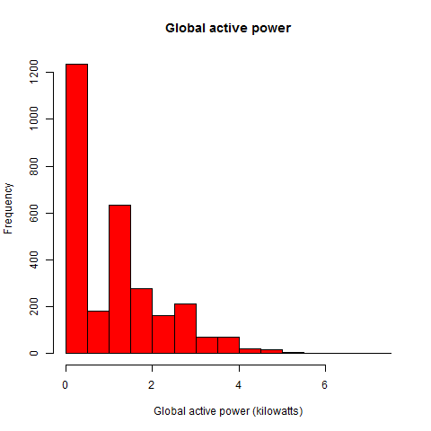
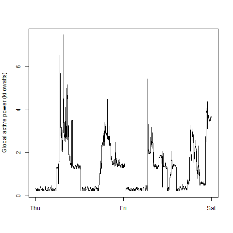

Guide to this project
=====================


I have carried out this project in the way that I like to do things. I have separated all of the plot commands into separate R files, as suggested. 

I have also included a separate file for quickly extracting the data we need using the `data.table` package.

To run the analysis, run the following commands:


```
source('save_data_run.R')
tidy_save() # saves all the data to a compressed RDS file
runAnalysis() # runs the functions for each plot
```

The tidied data.frame can be found (and loaded using `readRDS()`) at electric.rds

The output that I got, in terms of graphs, is as follows:

Plot 1
------

Simple enough. Just a histogram, with bin set to 0.5 (which I think it does automatically anyway!

 

Plot 2
------

The second one was just a simple line chart `plot`

 

Plot 3
------

Three different line charts. Used `plot`, then `lines`

 

Plot 4
------

I'm pretty sure I could have got the `mar` commmand to work better here. But I ran out of time I'm afraid!

 


